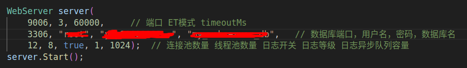
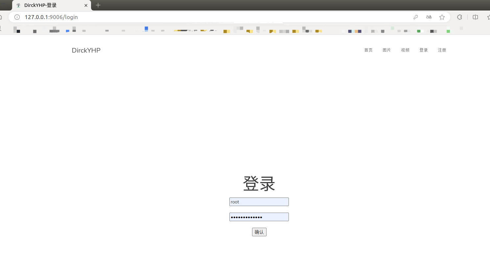

# 高性能多并发Web服务器（C++11）
## Introduction
用C++实现的高性能WEB服务器
## Function
- 利用IO复用技术Epoll与线程池实现多线程的Reactor高并发模型
- 利用正则与状态机解析HTTP请求报文，实现处理静态资源的请求
- 利用标准库容器封装char，实现自动增长的缓冲区
- 基于小根堆实现定时器，关闭超时的非活动连接
- 利用单例模式与阻塞队列实现异步的日志系统，记录服务器运行状态
- 利用RAII机制实现了数据库连接池，减少数据库连接建立与关闭的开销，同时实现了用户注册登录功能

## Environment
- Ubuntu 18.04
- Modern C++
- MySql
- gits

## Content

```
|——bin              可执行文件
|——build            
|————Makefile
|——code             源代码
|————buffer
|————http
|————log
|————pool
|————server
|————timer
|————main.cpp
|——log              日志文件
|——resources        静态资源
|——webbench-1.5     压力测试
|——Makefile
|——README.md
```


## Build & Usage

**一、配置好自己的数据库**
// 建立yourdb库
create database yourdb;

// 创建user表
USE yourdb;
CREATE TABLE user(
    username char(50) NULL,
    password char(50) NULL
)ENGINE=InnoDB;

// 添加数据
INSERT INTO user(username, password) VALUES('name', 'password');


**二、在main.cpp的构造函数初始化中修改数据库配置为你自己定义的**


**三、运行**
make
./bin/server

然后就可以打开浏览器输入ip和端口了，测试的话，可以本地回环，即127.0.0.1:9006  // 9006 这个端口号也需要和main.cpp里面对应

**四、结果**


## Thanks

Linux高性能服务器编程，游双著. 

[@qinguoyi](https://github.com/qinguoyi/TinyWebServer)

[@markparticle](https://github.com/markparticle/WebServer)

[@JehanRio](https://github.com/JehanRio/TinyWebServer)

## 原理剖析
[利用IO复用技术Epoll与线程池实现多线程的Reactor高并发模型](./code/server/README.md)
[利用正则与状态机解析HTTP请求报文，实现处理静态资源的请求](./code/http/README.md)
[利用标准库容器封装char，实现自动增长的缓冲区](./code/buffer/README.md)
[基于小根堆实现定时器，关闭超时的非活动连接](./code/timer/README.md)
[利用单例模式与阻塞队列实现异步的日志系统，记录服务器运行状态](./code/log/README.md)
[利用RAII机制实现了数据库连接池，减少数据库连接建立与关闭的开销](./code/pool/README.md)

## 后续优化的点
- 线程池的实现⽅⾯，采⽤了⽐较朴素的 Round Robin，可以在负载均衡算法上进⾏优化
- 数据库部分引入跳表
- 添加内存池
- 部署到云服务器上
    - 压⼒测试⼯具本身会占⽤⼀定的资源，导致本地进⾏压测出来的结果不⼀定会准确

