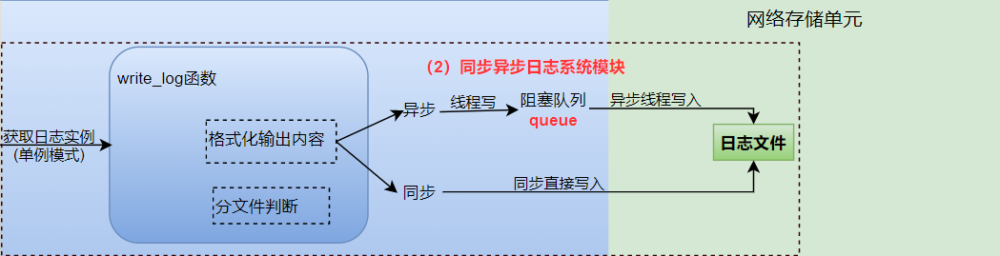

# 日志系统
对于一个服务器而言，不论是在调试中还是在运行中，都需要通过打日志的方式来记录程序的运行情况。

+ **同步日志**：日志写入函数与工作线程串行执行，由于涉及到I/O操作，当单条日志比较大的时候，同步模式会阻塞整个处理流程，服务器所能处理的并发能力将有所下降，尤其是在峰值的时候，写日志可能成为系统的瓶颈。
    - **优点**：
简单易实现：同步日志通常更容易实现和理解，因为它直接在处理请求的线程中进行。
时序准确：由于日志记录是在处理请求的同时进行的，因此日志的时间戳通常非常准确，反映了请求处理的实际时间。
    - **缺点**：
    性能影响：同步日志记录可能会导致性能问题，因为它会阻塞当前线程，直到日志写入操作完成。在高负载的情况下，这可能会导致请求延迟。
磁盘I/O压力：同步日志记录可能会导致频繁的磁盘I/O操作，这可能会成为系统的瓶颈。

+ **异步日志**：将所写的日志内容先存入阻塞队列中，写线程从阻塞队列中取出内容，写入日志。

## 日志的运流程
1. 使用单例模式（局部静态变量方法）获取实例Log::getInstance()。
2. 通过实例调用Log::getInstance()->init()函数完成初始化，若设置阻塞队列大小大于0则选择异步日志，等于0则选择同步日志，更新isAysnc变量。
3. 通过实例调用write_log()函数写日志，首先根据当前时刻创建日志（前缀为时间，后缀为".log"，并更新日期today和当前行数lineCount。
4. 在write_log()函数内部，通过isAsync变量判断写日志的方法：如果是异步，工作线程将要写的内容放进阻塞队列中，由写线程在阻塞队列中取出数据，然后写入日志；如果是同步，直接写入日志文件中。
> 该函数采用了不定参数的形式，具体使用步骤如下：
> 
> ```C++
> va_list vaList;
> va_start(vaList, format);
> int m = vsnprintf(buff_.BeginWrite(), buff_.WritableBytes(), format, vaList);
> va_end(vaList);
> ```

## blockqueue
阻塞队列采用deque实现。
若`MaxCapacity`为0，则为同步日志，不需要阻塞队列。
内部有**生产者消费者模型**，搭配锁、条件变量使用。其中，消费者防止任务队列为空，生产者防止任务队列满。


## 日志的分级与分文件：
**分级情况：**
+ Debug，调试代码时的输出，在系统实际运行时，一般不使用。
+ Warn，这种警告与调试时终端的warning类似，同样是调试代码时使用。
+ Info，报告系统当前的状态，当前执行的流程或接收的信息等。
+ Erro，输出系统的错误信息

**分文件情况：**

1. 按天分，日志写入前会判断当前today是否为创建日志的时间，若为创建日志时间，则写入日志，否则按当前时间创建新的log文件，更新创建时间和行数。
2. 按行分，日志写入前会判断行数是否超过最大行限制，若超过，则在当前日志的末尾加lineCount / MAX_LOG_LINES为后缀创建新的log文件。

## 单例模式
单例模式（Singleton Pattern）是一种常用的软件设计模式，它确保一个类只有一个实例，并提供一个全局访问点。这种模式在需要全局唯一对象时非常有用，例如配置管理、日志记录器、数据库连接池等场景。
[C++单例模式总结](https://blog.csdn.net/unonoi/article/details/121138176)