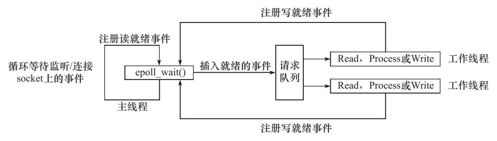
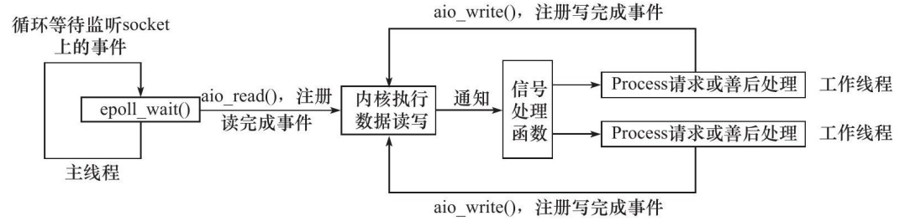

# 两种事件处理模型的简介：Reactor 和 Proactor
    同步I/O模型通常用于实现Reactor模式，异步I/O模型则用于实现Proactor模式。
## Reactor模式
&emsp;Reactor是这样一种模式，它要求主线程（I/O处理单元，下同）**只负责监听文件描述上是否有事件发生，有的话就立即将该事件通知工作线程（逻辑单元，下同）。除此之外，主线程不做任何其他实质性的工作**。读写数据，接受新的连接，以及处理客户请求均在工作线程中完成。
### 使用同步I/O模型（以epoll_wait为例）实现的Reactor模式的工作流程是:
1. 主线程往epoll内核事件表中注册socket上的读就绪事件。
2. 主线程调用epoll_wait等待socket上有数据可读。
3. 当socket上有数据可读时，epoll_wait通知主线程。主线程则将 socket可读事件放入请求队列。
4. 睡眠在请求队列上的某个工作线程被唤醒，它从socket读取数据，并处理客户请求，然后往epoll内核事件表中注册该socket上的写就绪事件。
5. 主线程调用epoll_wait等待socket可写。
6. 当socket可写时，epoll_wait通知主线程。主线程将socket可写事件放入请求队列。
7. 睡眠在请求队列上的某个工作线程被唤醒，它往socket上写入 服务器处理客户请求的结果。
  
### Reactor模型优点
1. 简单易懂：Reactor 模型的结构相对简单，易于理解和实现。
2. 高效的 I/O 处理：通过事件驱动，可以高效地处理大量并发的 I/O 操作。
3. 线程安全性：Reactor 模型通常是线程安全的，可以在多线程环境下安全地处理事件。
4. 灵活性：Reactor 模型支持多种类型的事件源和事件处理函数，可以根据具体需求进行扩展和定制。
### Reactor模型缺点
1. 阻塞 I/O 操作：在 Reactor 模型中，I/O 操作通常是阻塞的，这可能导致某些线程在等待 I/O 操作完成时被阻塞。
2. 回调地狱：使用大量回调函数可能导致代码难以阅读和维护，尤其是在复杂的应用中。
3. 线程资源消耗：由于需要维护一个或多个事件循环线程，Reactor 模型可能消耗较多的线程资源。

## Proactor模式
&emsp;与Reactor模式不同，**Proactor模式将所有I/O操作都交给主线程和内核来处理，工作线程仅仅负责业务逻辑**。
### 使用异步I/O模型（以aio_read和aio_write为例）实现的Proactor模式的工作流程是：
1. 主线程调用aio_read函数向内核注册socket上的读完成事件，并告诉内核用户读缓冲区的位置，以及读操作完成时如何通知应用程序（这里以信号为例，详情请参考sigevent的man手册）。
2. 主线程继续处理其他逻辑。
3. 当socket上的数据被读入用户缓冲区后，内核将向应用程序发送一个信号，以通知应用程序数据已经可用。
4. 应用程序预先定义好的信号处理函数选择一个工作线程来处理客户请求。工作线程处理完客户请求之后，调用aio_write函数向内核注册socket上的写完成事件，并告诉内核用户写缓冲区的位置，以及写操作完成时如何通知应用程序（仍然以信号为例）。
5. 主线程继续处理其他逻辑。
6. 当用户缓冲区的数据被写入socket之后，内核将向应用程序发送一个信号，以通知应用程序数据已经发送完毕。
7. 应用程序预先定义好的信号处理函数选择一个工作线程来做善后处理，比如决定是否关闭socket。

### Proactor模型优点
1. 更高的性能：通过将 I/O 操作的处理转移到操作系统，减少了应用程序在 I/O 操作上的阻塞时间，提高了系统的整体性能。
2. 更好的并发支持：Proactor 模型可以更好地支持大规模并发的 I/O 操作。
3. 简化的编程模型：Proactor 模型简化了异步 I/O 操作的编程，使开发者更专注于业务逻辑的实现。
### Proactor模型缺点
1. 实现复杂：Proactor 模型的实现相对复杂，需要操作系统和库的支持。
2. 难以支持所有 I/O 操作：并非所有的 I/O 操作都可以异步执行，某些操作可能仍然需要阻塞。
3. 编程语言和平台限制：Proactor 模型的实现可能受到编程语言和平台的限制。

## 总结
1. Reactor（反应器）模型：
&emsp;在Reactor模型中，一个或多个线程负责监听和分发事件。当有 I/O 事件发生时（如网络连接建立、数据到达等），Reactor线程会将事件分发到相应的处理函数或回调函数进行处理。这种模型的优势是简单、高效，适用于处理大量并发的 I/O 操作。常见的实现方式包括单线程Reactor、多线程Reactor等。
2. Proactor（前摄器）模型：
&emsp;在Proactor模型中，应用程序通过异步 I/O 操作（如aio_read、aio_write等）提交 I/O 请求，并将回调函数与请求关联。操作系统负责异步地完成 I/O 操作，并在操作完成后调用回调函数通知应用程序。Proactor模型将 I/O 处理的责任从应用程序转移到了操作系统，从而提高了应用程序的并发性能和效率。这种模型通常需要操作系统支持异步 I/O 才能实现。
> 总的来说，**Reactor模型适合于同步 I/O 操作，应用程序需要自己处理 I/O 事件；而Proactor模型适合于异步 I/O 操作，操作系统负责处理 I/O 事件并通知应用程序**。选择哪种模型取决于具体的应用场景和需求。
需要注意的是，Reactor 模型和 Proactor 模型并不是互斥的，它们可以结合使用以满足不同的需求。在实际应用中，选择哪种模型取决于具体的应用场景和需求。

### 关于socket可写的几种表述
> 在Reactor模式中，Socket可写通常指的是Socket的连接已经准备好，可以进行数据写入操作。具体来说，当一个Socket在epoll内核事件表中注册了写就绪事件，并且主线程通过epoll_wait调用等待该Socket可写时，如果Socket的连接状态变为可写，那么epoll_wait会通知主线程。主线程会将这个可写事件放入请求队列中，然后唤醒睡眠在队列上的某个工作线程。这个工作线程会向Socket中写入数据，并完成相应的操作。

> 在Reactor模式中，socket可写指的是socket的连接已经准备好，可以写入数据了。具体来说，当socket的**可写缓冲区中有足够的空间可以容纳待发送的数据**时，就可以认为该socket是可写的。此时，工作线程可以向socket写入数据，而不会导致阻塞或数据丢失。

> 在Socket编程中，Socket的可读和可写状态是非常重要的概念。Socket可读指的是Socket的接收缓冲区中有数据可以读取，而Socket可写则指的是Socket的连接已经准备好，可以向其发送数据。这些状态的变化通常由操作系统内核来监控，并通过特定的机制（如epoll）通知应用程序。

> 在Reactor模式中，主线程主要负责监听文件描述符上的事件，并将事件通知给工作线程处理。工作线程则负责实际的读写操作、接受新连接以及处理客户请求。这种设计模式可以高效地处理大量的并发连接，提高系统的吞吐量和响应速度。

> 在Reactor模式中，socket可写通常指的是socket的输出缓冲区有足够的空间来容纳更多的数据，即可以向该socket写入更多的数据而不会导致缓冲区溢出。具体来说，当Reactor的主线程检测到某个socket处于可写状态时，它会将一个可写事件放入请求队列中。然后，正在等待该事件的工作线程会被唤醒，并从socket中读取数据（如果之前还有未处理的数据）或者向该socket写入数据。这样，Reactor模式就能够高效地处理大量的并发连接，提高系统的吞吐量和响应速度。

### 使用IO复用技术和线程池，可以实现多线程的Reactor高并发模型。下面是一个简单的实现步骤
1. 初始化epoll：首先，你需要初始化一个epoll实例，并设置它监听你关心的文件描述符（通常是socket）。
2. 创建线程池：然后，你需要创建一个线程池，用于处理epoll触发的IO事件。线程池中的每个线程都可以被视为一个独立的Reactor。
3. 注册事件到epoll：对于每个需要监控的socket，你需要将其注册到epoll中，并指定你关心的事件类型（如读事件、写事件等）。
4. 等待事件触发：在主线程中，你调用epoll的等待函数，等待事件触发。当有事件触发时，epoll会返回触发事件的文件描述符和事件类型。
5. 分发事件到线程池：当事件触发时，主线程将事件分发到线程池中的某个线程。这通常通过任务队列实现，主线程将事件封装为任务，然后放入任务队列中，线程池中的线程从队列中取出任务进行处理。
6. 处理事件：线程池中的线程接收到事件后，根据事件类型进行相应的处理。例如，如果是一个读事件，线程可能会从socket中读取数据，并进行进一步的处理。
7. 返回结果：处理完事件后，线程可能需要将结果返回给调用者。这可以通过回调函数、Future、Promise等方式实现。
#### 需要注意以下几点：
-  确保线程安全：在多线程环境中，需要确保对共享资源的访问是线程安全的。这可以通过使用锁、原子操作、线程局部存储等方式实现。
- 优雅地处理错误：在处理IO事件时，可能会遇到各种错误，如网络中断、socket关闭等。你需要优雅地处理这些错误，避免程序崩溃或产生未定义行为。
- 考虑性能优化：高并发模型通常需要处理大量的并发连接和事件，因此需要考虑性能优化。例如，可以通过使用无锁数据结构、减少内存分配、批量处理等方式提高性能。

# WebServer
这是整个WebServer最顶层的接口，每连接进来一个用户，就有一个新的套接字创建并加入epoller中，并且给该用户创建一个时间结点，加入时间堆中，同时将该用户加入users哈希表中（key:fd,value:HttpConn)

## 软件层次的设计
            WebServer                     :服务器逻辑框架：　epoller监听＋线程池读写
                |
                |
        Epoller    Timer                  :epoll操作封装，　定时器给连接计时
            |        |
            ----------
                |
          HttpConnection                  ：把监听连接返回的文件描述符封装成一个连接实例, 对readv, write网络数据传输进行封装，　管理连接
          |            |
    HttpRequest  HttpResponse             ：请求操作封装，响应操作封装，业务逻辑
          |            |
          --------------
                |
              Buffer                      ：读写缓冲区
  
  ThreadPool                              : 线程池，负责读写操作（上图上两层属于主线程，下三层属于线程池）
  Log                                     : 日志类

## 设计
按照软件分层设计的草图，WebServer设计目标为：

+ 监听IO事件
+ 处理超时连接
数据：
int port_; 　　　　//端口

int timeoutMS_; 　　　　//毫秒MS,定时器的默认过期时间

bool isClose_; 　　　//服务启动标志

int listenFd_; 　　//监听文件描述符

bool openLinger_;　　//优雅关闭选项

char* srcDir_;　　　//需要获取的路径

uint32_t listenEvent_;　//初始监听描述符监听设置

uint32_t connectionEvent_;//初始连接描述符监听设置

std::unique_ptrtimer_;　 //定时器

std::unique_ptr threadpool_; //线程池

std::unique_ptr epoller_; //反应堆

std::unordered_map<int, HTTPconnection> users_;//连接队列

+ 函数：

    1. 构造函数: 设置服务器参数　＋　初始化定时器／线程池／反应堆／连接队列

    2. 析构函数: 关闭listenFd_，　销毁　连接队列/定时器／线程池／反应堆

    3. 主函数start()

        1. 创建端口，绑定端口，监听端口，　创建epoll反应堆，　将监听描述符加入反应堆

        2. 等待事件就绪

            1. 连接事件－－＞DealListen()

            2. 写事件－－＞DealWrite()

            3. 读事件－－＞DealRead()

        3. 事件处理完毕，修改反应堆，再跳到２处循环执行

    4. DealListen:  新初始化一个ＨttpConnection对象

    5. DealWrite：　对应连接对象进行处理－－＞若处理成功，则监听事件转换成　读　事件

    6. DealRead：　 对应连接对象进行处理－－＞若处理成功，则监听事件转换成　写　事件
## Epoller
对增删查改的简单封装。
## WebServer 类详解
### 1. 初始化
```c++
threadpool_(new ThreadPool(threadNum))
InitSocket_();//初始化Socket连接
InitEventMode_(trigMode);//初始化事件模式
SqlConnPool::Instance()->Init();//初始化数据库连接池
Log::Instance()->init(logLevel, "./log", ".log", logQueSize);   
```
创建线程池：线程池的构造函数中会创建线程并且detach()

初始化Socket的函数`InitSocket_();` C/S中，服务器套接字的初始化无非就是socket - bind - listen - accept - 发送接收数据这几个过程；函数执行到listen后，把前面得到的listenfd添加到epoller模型中，即把accept()和接收数据的操作交给epoller处理了。并且把该监听描述符设置为非阻塞。

初始化事件模式函数`InitEventMode_(trigMode);`，将`listenEvent_` 和 `connEvent_`都设置为EPOLLET模式。

初始化数据库连接池`SqlConnPool::Instance()->Init();`创造单例连接池，执行初始化函数。

初始化日志系统：在初始化函数中，创建阻塞队列和写线程，并创建日志。

### 2. 启动WebServer
接下来启动WebServer，首先需要设定`epoll_wait()`等待的时间，这里我们选择调用定时器的`GetNextTick()`函数，这个函数的作用是返回最小堆堆顶的连接设定的过期时间与现在时间的差值。这个时间的选择可以保证服务器等待事件的时间不至于太短也不至于太长。接着调用`epoll_wait()`函数，返回需要已经就绪事件的数目。这里的就绪事件分为两类：收到新的http请求和其他的读写事件。
这里设置两个变量fd和events分别用来存储就绪事件的文件描述符和事件类型。

1.收到新的HTTP请求的情况

在fd==listenFd_的时候，也就是收到新的HTTP请求的时候，调用函数DealListen_();处理监听，接受客户端连接；

2.已经建立连接的HTTP发来IO请求的情况

在events& EPOLLIN 或events & EPOLLOUT为真时，需要进行读写的处理。分别调用 DealRead_(&users_[fd])和DealWrite_(&users_[fd]) 函数。这里需要说明：DealListen_()函数并没有调用线程池中的线程，而DealRead_(&users_[fd])和DealWrite_(&users_[fd]) 则都交由线程池中的线程进行处理了。

### 3. I/O处理的具体流程
`DealRead_(&users_[fd])`和`DealWrite_(&users_[fd])` 通过调用
```c++
threadpool_->AddTask(std::bind(&WebServer::OnRead_, this, client));     //读
threadpool_->AddTask(std::bind(&WebServer::OnWrite_, this, client));    //写
```
函数来取出线程池中的线程继续进行读写，而主进程这时可以继续监听新来的就绪事件了。

`OnRead_()`和`OnWrite_()`函数分别进行读写的处理。

`OnRead_()`函数首先把数据从缓冲区中读出来(调用HttpConn的read,read调用ReadFd读取到读缓冲区BUFFER)，然后交由逻辑函数`OnProcess()`处理。这里多说一句，`process()`函数在解析请求报文后随即就生成了响应报文等待OnWrite_()函数发送。

这里必须说清楚OnRead_()和OnWrite_()函数进行读写的方法，那就是：**分散读和集中写**
> 分散读（scatter read）和集中写（gatherwrite）具体来说是来自读操作的输入数据被分散到多个应用缓冲区中，而来自应用缓冲区的输出数据则被集中提供给单个写操作。
这样做的好处是：它们只需一次系统调用就可以实现在文件和进程的多个缓冲区之间传送数据，免除了多次系统调用或复制数据的开销。

`OnWrite_()`函数首先把之前根据请求报文生成的响应报文从缓冲区交给fd，传输完成后修改该fd的events.

``OnProcess()``就是进行业务逻辑处理（解析请求报文、生成响应报文）的函数了。

参考博客：https://blog.csdn.net/ccw_922/article/details/124530436